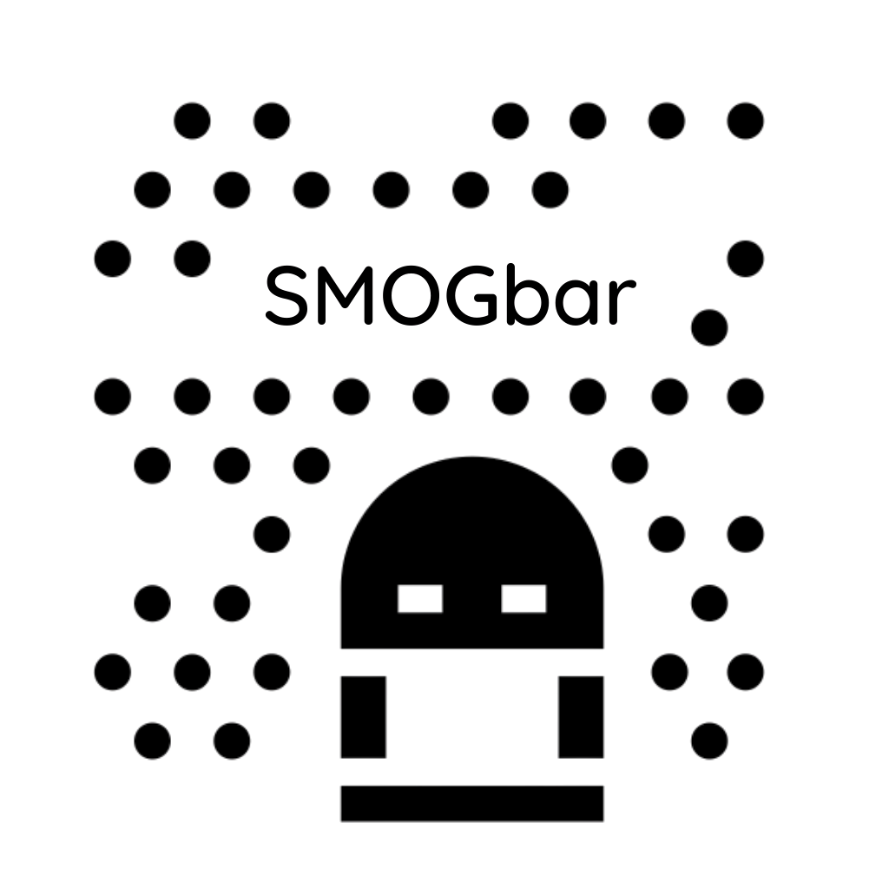

<!-- PROJECT LOGO -->
<br />
<p align="center">
  <a href="https://github.com/othneildrew/Best-README-Template">
    
  </a>

  <h3 align="center">SMOGBar</h3>

  <p align="center">
    An awesome, little menubar app for checking out air quality near you!
    <br />
    <a href="https://github.com/booua/smogbar/releases/tag/1.0.0">Download the SMOGBar!</a>
    <br />
    <br />
    <a href="https://github.com/booua/airly_widget/issues">Report Bug</a>
    ·
    <a href="https://github.com/booua/airly_widget/issues">Request Feature</a>
  </p>
  <p align="center">
    <a href="https://www.buymeacoffee.com/booua">
      
  </a>
  </p>
</p>

<!-- TABLE OF CONTENTS -->

## Table of Contents

- [About](#about-the-project)
  - [Built With](#built-with)
- [Getting Started](#getting-started)
- [Important Notes/Todolist](#Important-Notes/Todolist)
- [Issues](#Issues)
- [Contributing](#contributing)
- [License](#license)
- [Contact](#contact)

<!-- ABOUT THE PROJECT -->

## About

[![Product Name Screen Shot][product-screenshot]](booua.github.io)

There are many great apps for checking out air quality such as Airly, SmogSmok, however, I didn't find one that really suit my needs so I created this one, available right from your menubar (OSX) or taskbar in Windows. I wanted something easy to read, accesable and minimalistic. With help from Airly API, this is what I came up with ;)

Oh, did I mention it comes with light and dark themes? 🚀

[![Product Name Screen Shot][product-screenshot2]](booua.github.io)

### Built With

As a source of air quality data I'm using API kindly provided by [Airly](https://developer.airly.org/docs). The app itself is built with:

- [Electron](https://www.electronjs.org/)
- [React](https://reactjs.org/) (create-react-app)
- [GraphQL](https://graphql.org/)

<!-- GETTING STARTED -->

## Getting Started

If you'd like to set up your your project locally, here's how:

1. Get your API Key at [https://developer.airly.org/docs](https://developer.airly.org/docs)
2. Clone the server repo

```sh
git clone https://github.com/booua/airly_widget_server
```

3. Install NPM packages

```sh
npm install
```

4. Enter your API in `.env` file

```JS
AIRLY_API_KEY = 'YOUR API KEY';
```
Don't forget to run the server ;) 

5. Clone this repo

```sh
git clone https://github.com/booua/airly_widget
```
6. Install [concurrently](https://www.npmjs.com/package/concurrently) and [wait-on](https://www.npmjs.com/package/wait-on)
```sh
npm install concurrently wait-on
```

7. Install rest of the dependencies:

```sh
npm install
```

8. In App.js point the ApolloClient to your server:

```js
const client = new ApolloClient({
  uri: "http://server:3000",
  cache: new InMemoryCache(),
});
```

9. Run dev

```sh
npm run dev
```

<!-- todolist-->

## Important Notes/Todolist

- For now the app is using my own server instance with one API key limited to **100 request / day**. I'm caching the data (in a nice way btw ;)) fetched from Airly and allowing it to be refreshed manually (button on top right corner) or once every 30mins. Best solution would be to allow individual users to register their accounts, but this would mean the app would be more cumbersome to use :C
  &nbsp;
- in order to exit the app you need to use keyboard shortcut **CMD + Q (Mac)** or **Alt + f4 (windows)**. It would be nice to have a context menu or a separate button
  &nbsp;

- app is taking a location based on users' IP address, which (I KNOW I KNOW, chill) is not really precise and can lead to showing the air quality near your ISP building, not yours, but electron is forcing usage of Google API (more info here: https://www.electronjs.org/docs/api/environment-variables#google_api_key)
  which I don't like and don't intend to pay for.
  &nbsp;
- fix bugs 🐛🐛🐛?

<!-- ISSUES -->

## Issues

See the [open issues](https://github.com/booua/airly_widget/issues) for a list of proposed features (and known issues).

<!-- CONTRIBUTING -->

## Contributing

Contributions are what make the open source community such an amazing place to be learn, inspire, and create. Any contributions you make are **greatly appreciated**.

1. Fork the Project
2. Create your Feature Branch or Bugfix Branch (`git checkout -b feature/newAmazingFeature` or `git checkout -b bugfix/iFixedABugWhichYouIntroducedYouMoron`)
3. Commit your Changes (`git commit -m 'Add some newAmazingFeature'`)
4. Push to the Branch (`git push origin feature/newAmazingFeature`)
5. Open a Pull Request
6. Give yourself a hig...self five!

<!-- LICENSE -->

## License

Distributed under the MIT License. See `LICENSE` for more information.

<!-- CONTACT -->

## Contact

Jack Paciorek - jack.paciorek(at)gmail.com

<!-- MARKDOWN LINKS & IMAGES -->
<!-- https://www.markdownguide.org/basic-syntax/#reference-style-links -->

[contributors-shield]: https://img.shields.io/github/contributors/othneildrew/Best-README-Template.svg?style=flat-square
[contributors-url]: https://github.com/booua/airly_widget/graphs/contributors
[forks-shield]: https://img.shields.io/github/forks/othneildrew/Best-README-Template.svg?style=flat-square
[forks-url]: https://github.com/booua/airly_widget/network/members
[stars-shield]: https://img.shields.io/github/stars/othneildrew/Best-README-Template.svg?style=flat-square
[stars-url]: https://github.com/booua/airly_widget/stargazers
[issues-shield]: https://img.shields.io/github/issues/othneildrew/Best-README-Template.svg?style=flat-square
[issues-url]: https://github.com/booua/airly_widget/issues
[license-shield]: https://img.shields.io/github/license/othneildrew/Best-README-Template.svg?style=flat-square
[license-url]: https://github.com/booua/airly_widget/blob/master/LICENSE.txt
[linkedin-shield]: https://img.shields.io/badge/-LinkedIn-black.svg?style=flat-square&logo=linkedin&colorB=555
[linkedin-url]: https://linkedin.com/in/othneildrew
[product-screenshot]: src/images/screenshotdark.png
[product-screenshot2]: src/images/screenshotlight.png
